# Execution Plan - VPC Flow Log Anomaly Detection System

## Detailed Analysis Summary

### Project Characteristics
- **Project Type**: Greenfield (New system)
- **Transformation Type**: System-wide multi-service architecture
- **Primary Changes**: Complete new security system with AI agents
- **Complexity Level**: Complex (15+ AWS services, real-time processing, ML/AI integration)

### Change Impact Assessment
- **User-facing changes**: Yes - React-based analyst dashboard with real-time visualization
- **Structural changes**: Yes - Multi-agent architecture with streaming analytics pipeline
- **Data model changes**: Yes - DynamoDB tables, OpenSearch indexes, S3 Parquet schemas
- **API changes**: Yes - Bedrock agent APIs, Lambda functions, Step Functions workflows
- **NFR impact**: Yes - Performance (100M+ logs/day), security (threat detection), cost optimization ($0.75/day target)

### Risk Assessment
- **Risk Level**: High
- **Rollback Complexity**: Moderate (Infrastructure-as-Code enables clean rollback)
- **Testing Complexity**: Complex (Real-time processing, AI agent behavior, integration testing)

## Workflow Visualization

```mermaid
flowchart TD
    Start(["User Request"])
    
    subgraph INCEPTION["🔵 INCEPTION PHASE"]
        WD["Workspace Detection<br/><b>COMPLETED</b>"]
        RA["Requirements Analysis<br/><b>COMPLETED</b>"]
        WP["Workflow Planning<br/><b>IN PROGRESS</b>"]
        AD["Application Design<br/><b>EXECUTE</b>"]
        UG["Units Generation<br/><b>EXECUTE</b>"]
    end
    
    subgraph CONSTRUCTION["🟢 CONSTRUCTION PHASE"]
        FD["Functional Design<br/><b>EXECUTE</b>"]
        NFRA["NFR Requirements<br/><b>EXECUTE</b>"]
        NFRD["NFR Design<br/><b>EXECUTE</b>"]
        ID["Infrastructure Design<br/><b>EXECUTE</b>"]
        CG["Code Generation<br/><b>EXECUTE</b>"]
        BT["Build and Test<br/><b>EXECUTE</b>"]
    end
    
    subgraph OPERATIONS["🟡 OPERATIONS PHASE"]
        OPS["Operations<br/><b>PLACEHOLDER</b>"]
    end
    
    Start --> WD
    WD --> RA
    RA --> WP
    WP --> AD
    AD --> UG
    UG --> FD
    FD --> NFRA
    NFRA --> NFRD
    NFRD --> ID
    ID --> CG
    CG --> BT
    BT --> End(["Complete"])
    
    style WD fill:#90EE90,stroke:#2d5016,stroke-width:3px
    style RA fill:#90EE90,stroke:#2d5016,stroke-width:3px
    style WP fill:#90EE90,stroke:#2d5016,stroke-width:3px
    style AD fill:#FFE4B5,stroke:#8B7355,stroke-width:2px,stroke-dasharray: 5 5
    style UG fill:#FFE4B5,stroke:#8B7355,stroke-width:2px,stroke-dasharray: 5 5
    style FD fill:#FFE4B5,stroke:#8B7355,stroke-width:2px,stroke-dasharray: 5 5
    style NFRA fill:#FFE4B5,stroke:#8B7355,stroke-width:2px,stroke-dasharray: 5 5
    style NFRD fill:#FFE4B5,stroke:#8B7355,stroke-width:2px,stroke-dasharray: 5 5
    style ID fill:#FFE4B5,stroke:#8B7355,stroke-width:2px,stroke-dasharray: 5 5
    style CG fill:#90EE90,stroke:#2d5016,stroke-width:3px
    style BT fill:#90EE90,stroke:#2d5016,stroke-width:3px
    style OPS fill:#f0f0f0,stroke:#999999,stroke-width:2px,stroke-dasharray: 5 5
    style Start fill:#E6E6FA,stroke:#4B0082,stroke-width:2px
    style End fill:#E6E6FA,stroke:#4B0082,stroke-width:2px
    style INCEPTION fill:#E3F2FD,stroke:#1976D2,stroke-width:3px
    style CONSTRUCTION fill:#E8F5E9,stroke:#388E3C,stroke-width:3px
    style OPERATIONS fill:#FFF9C4,stroke:#F57C00,stroke-width:3px
```

## Phases to Execute

### 🔵 INCEPTION PHASE
- [x] Workspace Detection (COMPLETED)
- [x] Requirements Analysis (COMPLETED)
- [x] Workflow Planning (IN PROGRESS)
- [ ] Application Design - EXECUTE
  - **Rationale**: Multi-agent system requires component architecture definition, service boundaries, and agent interaction patterns
- [ ] Units Generation - EXECUTE
  - **Rationale**: Complex system needs decomposition into manageable development units (ingestion, detection, agents, dashboard, infrastructure)

### 🟢 CONSTRUCTION PHASE
- [ ] Functional Design - EXECUTE (per-unit)
  - **Rationale**: Threat detection algorithms, agent prompts, and business logic require detailed design
- [ ] NFR Requirements - EXECUTE (per-unit)
  - **Rationale**: Critical performance (100M+ logs/day), security, and cost optimization requirements need assessment
- [ ] NFR Design - EXECUTE (per-unit)
  - **Rationale**: Real-time processing patterns, AI agent orchestration, and cost optimization strategies need design
- [ ] Infrastructure Design - EXECUTE (per-unit)
  - **Rationale**: 15+ AWS services require detailed infrastructure mapping and CDK implementation planning
- [ ] Code Generation - EXECUTE (ALWAYS, per-unit)
  - **Rationale**: Implementation of all components needed
- [ ] Build and Test - EXECUTE (ALWAYS)
  - **Rationale**: Comprehensive testing of real-time processing, AI agents, and integration scenarios

### 🟡 OPERATIONS PHASE
- [ ] Operations - PLACEHOLDER
  - **Rationale**: Future deployment and monitoring workflows

## Estimated Timeline
- **Total Phases**: 9 stages
- **Estimated Duration**: 8-12 development cycles (complex system with multiple integration points)

## Success Criteria
- **Primary Goal**: Production-ready VPC Flow Log Anomaly Detection System with 5 Bedrock agents
- **Key Deliverables**: 
  - Infrastructure-as-Code (CDK) for all 15+ AWS services
  - 5 Bedrock agents with action groups and knowledge bases
  - Real-time processing pipeline (Kinesis + Flink + SageMaker)
  - React-based analyst dashboard
  - Comprehensive monitoring and alerting
- **Quality Gates**: 
  - Handle 100M+ flow logs/day
  - <5 minute detection time
  - <5% false positive rate
  - Cost target of ~$0.75/day
  - All agent reasoning explainable
  - Complete audit trail